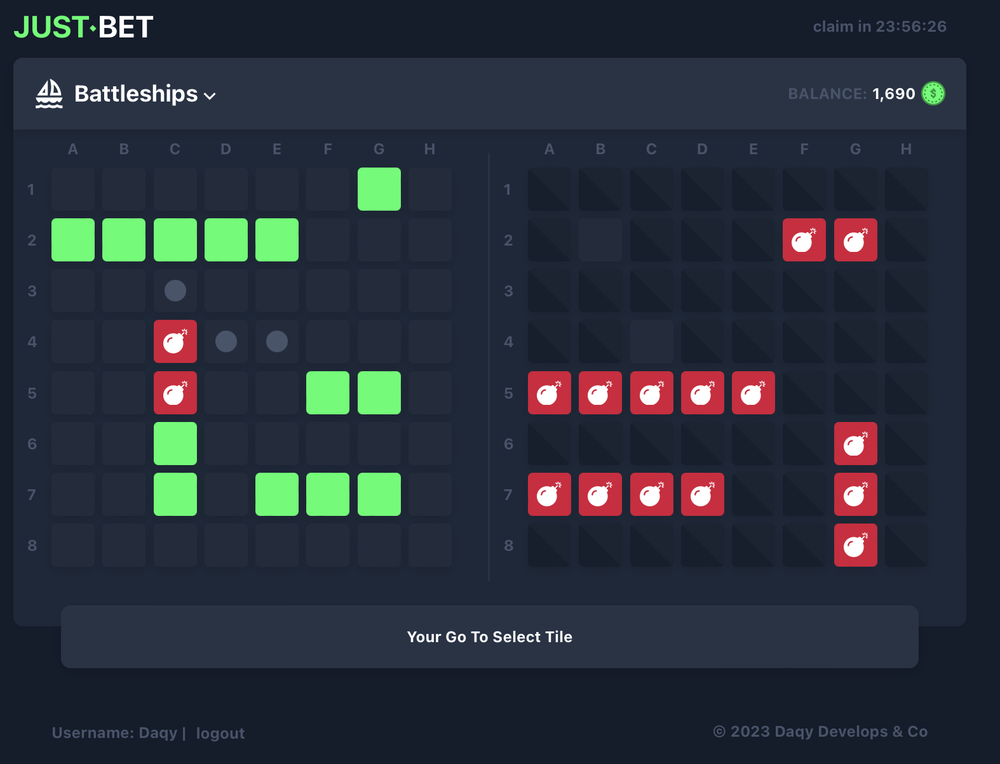

# Just-bet

Just bet is a non commercial gambling website for user enjoyment. Just-bet has two game modes you can play, minesweeper and battleships.

> _Recreated a previous website I made in `old-website` branch_

## Preview


Minesweeper game play, you as the user press tiles trying to avoid clicking the bomb square, the more you click the more you win, but also riskier.

Battleships game play, you get to vs another user in a game of battleships, winner takes all.

Game history page, currently this page only supports game history of minesweeper. The page will replay the game how it was played.

## Project Setup

```sh
npm install
```

### Compile and Hot-Reload for Development

```sh
npm run dev
```

### Type-Check, Compile and Minify for Production

```sh
npm run build
```

### Lint with [ESLint](https://eslint.org/)

```sh
npm run lint
```
